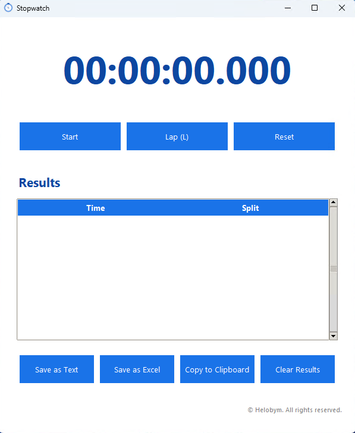

This software is developed by [Helobym](https://helobym.com)

The Simple Stopwatch Software is designed to provide users with an easy and effective way to measure elapsed time. It features intuitive controls to start, stop, and reset the timer, making it suitable for a variety of activities such as timing workouts, tracking presentations, or managing tasks that require precise intervals. The clear display ensures that users can quickly see the current time measurement at a glance. With its straightforward functionality, the software helps users stay on track and accurately monitor the duration of their activities, supporting both personal and professional time management needs.

[Demo Video](https://youtu.be/ZxZ9dbMOuxA)

